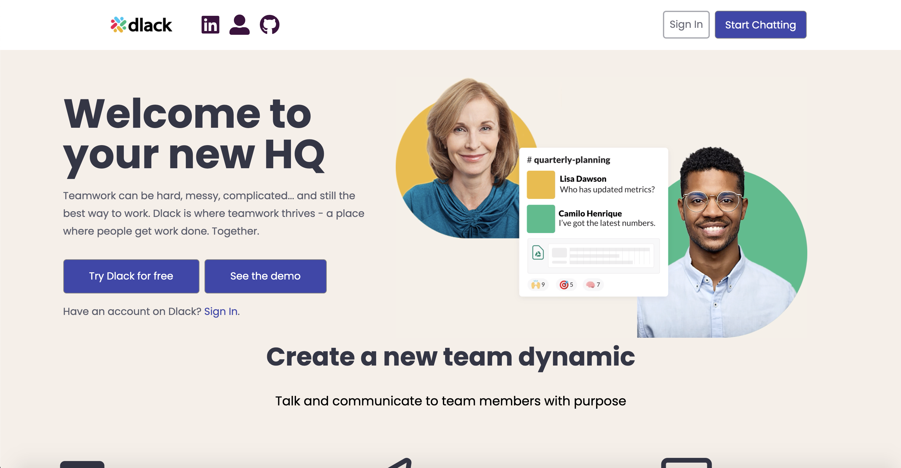

<p align="center"><a target="_blank" href="https://dlack.herokuapp.com/#/"></a></p>

<h1 align="center">Dlack</h1>
<p align="center">
  <a href="#dlack-uses-these-technologies">Technologies</a> •
  <a href="#key-features">Key Features</a> 
</p>

<p align="center">A web application implemented with websockets, Rails/PostgreSQL backend and React/Redux frontend stack. In order to increase productivity and get work done, users can create channels, direct messages, and group chats. Everything is done in real time.</p>

<p align="center"><a target="_blank" href="https://dlack.herokuapp.com/#/"></a></p>

## Dlack Uses These Technologies

### Backend

- Ruby on Rails
- PostgreSQL

### Frontend

- React
- Redux
- HTML
- CSS

### Other

- AWS S3
- ActiveCable (Websockets)
- Webpack / Babel

## Key Features

- Secure frontend to backend user authentication using BCrypt Hashing
- Users can create or direct messages, and update or delete channels for those that they have permission to
- Users can create, read, update, and delete messages
- Message feed dynamically updates using web sockets to display all incoming messages
- Full Notification System so users know when they receive a message

### Live Chat

Dlack utilizes ActionCable, a WebSocket framework for Rails, allowing open connections in order to edit, create, and delete messages and channels all in real-time <br>
View channels you've joined and communicate with other people - live! No need to refresh the page.<br>
Insert Image/gif here
<br>
Connections are made via the code below:

```js
// frontend/components/listener.jsx
createSockets(channelIds) {
  let result = channelIds.map((id) => {
      return App.cable.subscriptions.create(
        {
          channel: "MessageChannel",
          channel_id: id,
        },
        {
          received: (data) => {
           if (data.message.update) {
              let payload = {
                id: data.message.id,
                body: data.message.body,
                author_id: data.message.author_id,
                channel_id: data.message.channel_id,
                updated_at: data.message.updated_at,
                updated: true,
              };
              this.props.receiveUpdateMessage(payload);
            }
          },
        }
}
```

On the backend, cables are dynamically created using params (channel-id) sent from the frontend listener component:

```rb
# app/channels/message_channel.rb
class MessageChannel < ApplicationCable::Channel
  def subscribed
    stream_from "channel-#{params["channel_id"]}:messages"
  end

  def unsubscribed; end
end
```

When a message is then created by a user, the controller action will then broadcast the response to all subscribed users:

```rb
# app/controllers/messages_controller.rb
def create
  #After creating message:
  ActionCable
    .server #given
    .broadcast("channel-#{@message.channel_id}:messages",#channel identifier
            message: {      #broadcast both message and user //////   add user reducer receive message
                id: @message.id,
                body: @message.body,
                author_id: @message.author_id,
                channel_id: @message.channel_id,
                updated_at: @message.updated_at.strftime("%I:%M %p"),
            },
            user: user,
            notifications: notifications
          )
end
```

A similar setup was utilized for updating and deleting messages so that changes would be reflected for users in real-time
